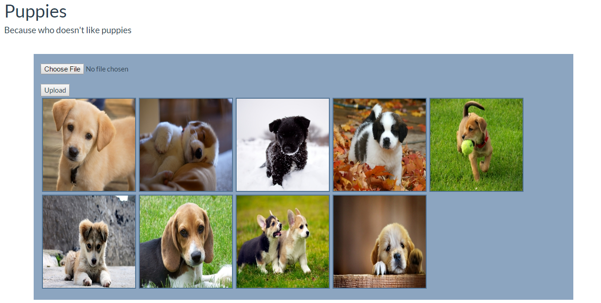
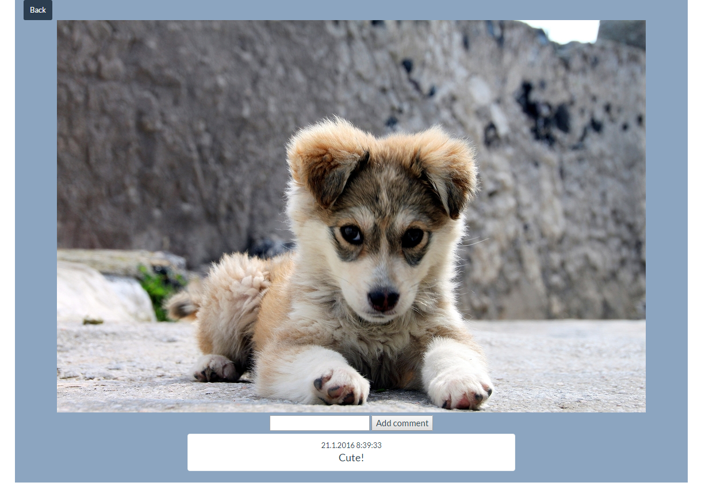

# imgSite
An ongoing demo project implemented with Node.js. Upload images and comment on them (without registering).

ToDo:
- Image scaling
- Rationalize & move functionality to client side
- Ordering of thumbnails
- Improve UI
- Security and error checks, user feedback

# Front page

# Image page

